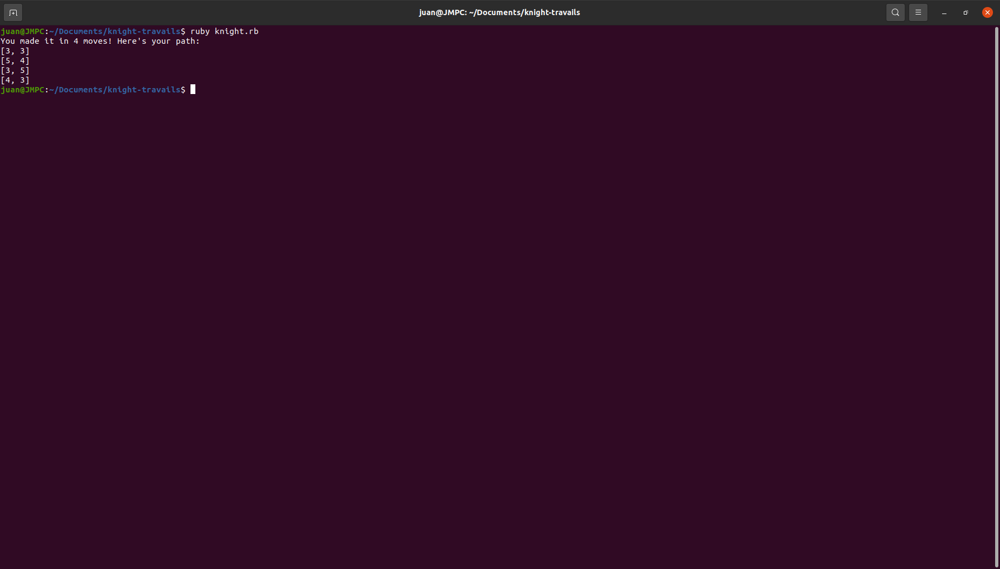

The purpose of this project was to practice algorithms and data structures with ruby. The problem is to move a knight piece in chess from any spot and move it to the next spot in the least amount of moves possible.

Run the project locally (prerequisites: ruby):

1. Download or clone the repository
2. Open root folder and run:

ruby knight.rb
